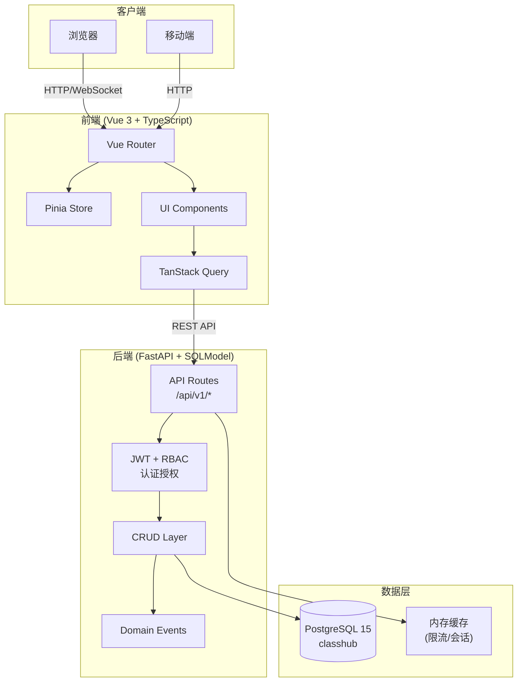
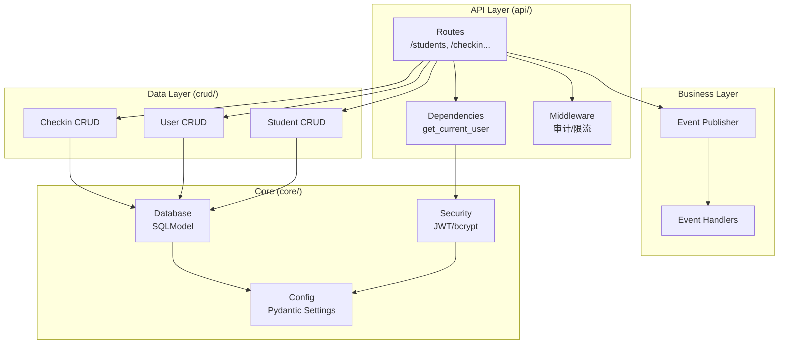
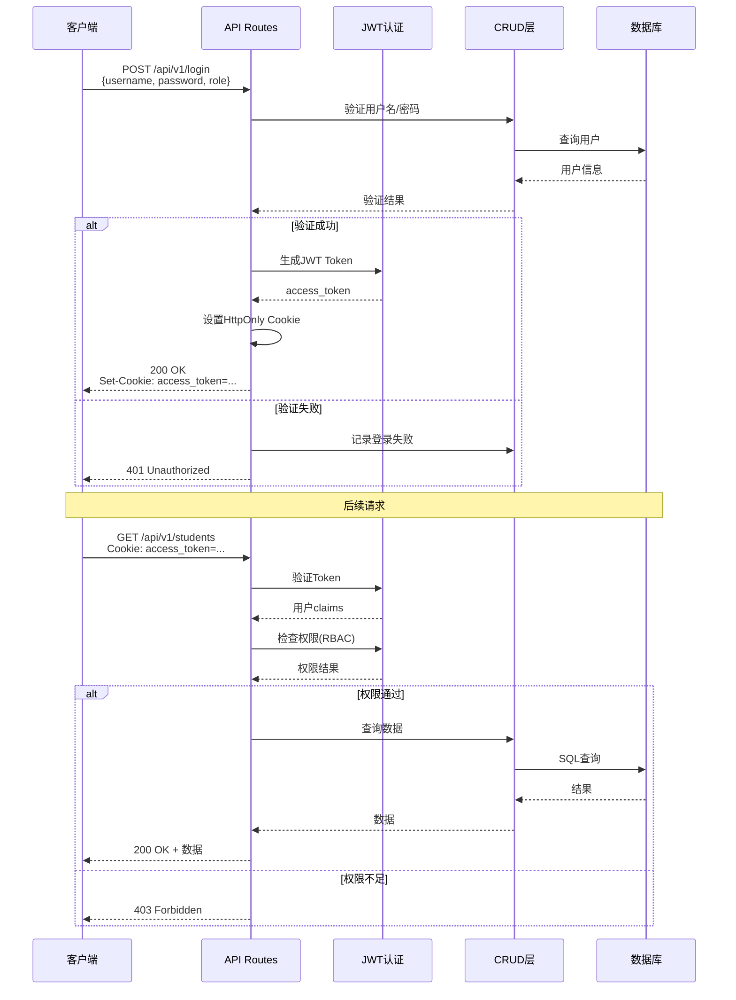
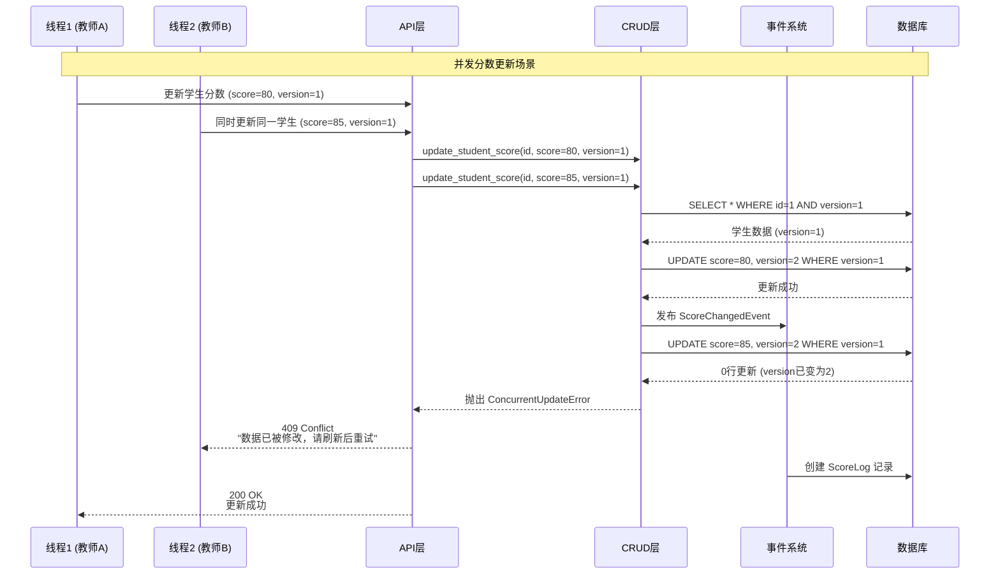
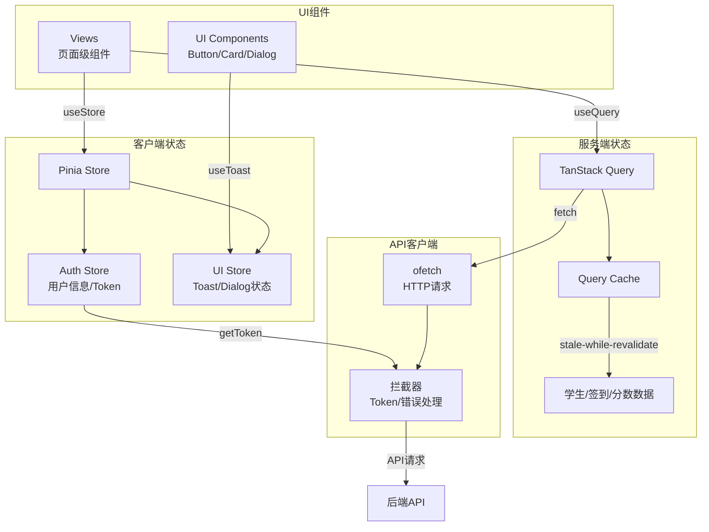
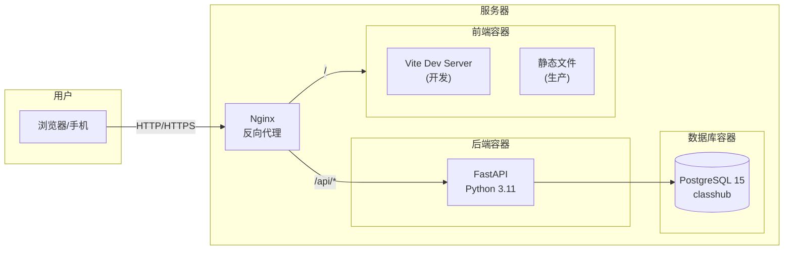

# ClassHub 架构图

---

**文档版本**: v1.0  
**最后更新**: 2026-04-03  
**适用版本**: v3.0.0+  
**状态**: ✅ 已同步代码

---

## 系统整体架构



---

## 后端分层架构



---

## 数据库 ER 图

```mermaid
erDiagram
    USER ||--o{ SCORE_LOG : "操作记录"
    USER ||--o{ CHECKIN_RECORD : "签到记录"
    USER ||--o{ AUDIT_LOG : "审计记录"
    STUDENT ||--o{ SCORE_LOG : "分数变更"
    STUDENT ||--o{ CHECKIN_RECORD : "签到"
    CLASS ||--o{ STUDENT : "包含"
    CLASS ||--o{ COURSE_SCHEDULE : "课程安排"
    USER ||--o{ COURSE_SCHEDULE : "授课"

    USER {
        int id PK
        string username UK
        string password_hash
        string name
        string role
        string assigned_class
        boolean is_active
        int login_fail_count
        datetime locked_until
        datetime last_login
        string last_login_ip
        int version
        datetime created_at
    }

    STUDENT {
        int id PK
        string student_id UK
        string name
        string class_name
        float score
        string password_hash
        boolean is_active
        datetime last_login
        int version
        datetime created_at
    }

    SCORE_LOG {
        int id PK
        int student_id FK
        int user_id FK
        float old_score
        float new_score
        float delta
        string reason
        string operator
        datetime created_at
    }

    CHECKIN_RECORD {
        int id PK
        int student_id FK
        int user_id FK
        string student_name
        string class_name
        string checkin_type
        datetime checkin_time
        string device_fingerprint
        string ip_address
        date checkin_date
    }

    CLASS {
        string name PK
        string description
        int student_count
        datetime created_at
    }

    COURSE_SCHEDULE {
        int id PK
        string class_name FK
        int teacher_id FK
        string course_name
        string day_of_week
        string start_time
        string end_time
        string classroom
        int week_type
    }

    AUDIT_LOG {
        int id PK
        int user_id FK
        string action
        string resource_type
        string resource_id
        string details
        string ip_address
        datetime created_at
    }
```

---

## 认证流程



---

## 分数更新流程（乐观锁）



---

## 前端状态管理



---

## 部署架构



---

## 相关文档

- [后端架构](../backend/README.md) - 详细的后端架构说明
- [前端架构](../frontend-v3/docs/ARCHITECTURE.md) - 前端架构详情
- [优化方案](./OPTIMIZATION_PLAN.md) - 架构优化建议

---

**注意**: 以上图表使用 Mermaid 语法，支持在 GitHub、GitLab 等平台上直接渲染。
