# ClassHub 操作指南（管理员 / 教师）

---

**文档版本**: v1.0
**最后更新**: 2026-09-12
**适用对象**: 管理员、教师
**对应界面**: frontend-v3（2026-09-12 版页面）

> 本文按**你现在能看到的页面**逐屏说明：每个菜单项是做什么的、有哪些按钮、填什么、点完会发生什么。
> 每个页面都配了**实拍截图**，并在 ⚠️ 处标出容易踩坑的注意事项。学生端操作不在本文范围。

---

## 目录

- [1. 登录与账号](#1-登录与账号)
- [2. 界面导航总览](#2-界面导航总览)
- [3. 管理员操作](#3-管理员操作)
  - [3.1 仪表板](#31-仪表板) ｜ [3.2 学期管理](#32-学期管理) ｜ [3.3 届管理](#33-届管理)
  - [3.4 班级管理](#34-班级管理) ｜ [3.5 课程管理](#35-课程管理) ｜ [3.6 教学班管理（开课 + 选课名单）](#36-教学班管理开课--选课名单)
  - [3.7 学生管理](#37-学生管理) ｜ [3.8 教师管理](#38-教师管理) ｜ [3.9 课表管理](#39-课表管理) ｜ [3.10 签到管理](#310-签到管理)
- [4. 教师操作](#4-教师操作)
  - [4.1 教师仪表板](#41-教师仪表板) ｜ [4.2 我的教学班](#42-我的教学班) ｜ [4.3 成绩录入（加减分 / 期末成绩）](#43-成绩录入加减分--期末成绩)
  - [4.4 排行榜](#44-排行榜) ｜ [4.5 课堂签到](#45-课堂签到) ｜ [4.6 课表管理（教师）](#46-课表管理教师)
  - [4.7 小组管理](#47-小组管理) ｜ [4.8 课堂问答](#48-课堂问答) ｜ [4.9 失物招领](#49-失物招领)
- [5. 开学准备清单](#5-开学准备清单)
- [6. 常见问题](#6-常见问题)
  - [6.1 登录与账号](#61-登录与账号) ｜ [6.2 数据与权限](#62-数据与权限) ｜ [6.3 已知问题](#63-已知问题)

---

## 1. 登录与账号

### 1.1 登录

1. 浏览器打开系统地址（开发环境默认 `http://localhost:5174`，正式地址由部署方提供）。
2. 在登录页选择**角色**：管理员 / 教师 / 学生。
3. 输入**用户名**与**密码**，点「登录」。

登录成功后由系统根据**账号自身的角色**跳转，分别进入 `/admin`、`/teacher` 或 `/student` 首页。

> ⚠️ 角色必须与账号匹配。若提示「用户名或密码错误」，除了检查用户名和密码，也要确认**所选角色**是否正确（同一个用户名只在它所属角色的入口登录）。

### 1.2 登录失败的可能提示

| 提示 | 含义 | 处理 |
|---|---|---|
| 用户名或密码错误 | 用户名、密码或所选角色不匹配 | 核对三者；忘记密码请联系管理员重置 |
| 账号已被禁用 | 该账号被停用 | 联系管理员启用 |
| 请求过于频繁（约 1 分钟后重试） | 触发了登录限流 | 等待约 1 分钟再试 |

### 1.3 修改密码

1. 点右上角**头像/菜单** → 「修改密码」。
2. 填写：**旧密码**、**新密码**（至少 6 个字符）、**确认新密码**。
3. 点保存。

校验提示（原文）：`请输入旧密码` / `请输入新密码` / `新密码至少需要 6 个字符` / `两次输入的新密码不一致`。

### 1.4 退出登录

点右上角菜单中的「退出登录」即可。退出后回到登录页，再进入需重新登录。

---

## 2. 界面导航总览

左侧为菜单，窄屏（手机/平板）下收起到左上角按钮里。

### 2.1 管理员菜单

| 分组 | 菜单项 | 用途 |
|---|---|---|
| 核心管理 | 仪表板 | 全校概览数据 |
| 核心管理 | 学期管理 | 建学期、切换当前学期、学期复制 |
| 核心管理 | 届管理 | 建届（如 2025届、2026届）、毕业归档 |
| 核心管理 | 班级管理 | 建班级（名称 + 专业 + 所属届）、改名、归档/删除 |
| 核心管理 | 课程管理 | 课程目录（编码、名称、院系、状态） |
| 核心管理 | 教学班 | 开课、安排授课教师、设定面向班级、管理选课名单 |
| 人员管理 | 学生管理 | 学生增删改查、学籍状态、转班、Excel 批量导入 |
| 人员管理 | 教师管理 | 教师账号创建、启停用、重置密码 |
| 教学运营 | 课表管理 | 导入/维护全校课表 |
| 教学运营 | 签到管理 | 查看各教学班签到记录 |

### 2.2 教师菜单

| 菜单项 | 用途 |
|---|---|
| 仪表板 | 本人教学班与课堂概览 |
| 我的教学班 | 本学期本人授课的教学班列表 → 进入成绩录入 |
| 排行榜 | 班级 / 全校成绩排行 |
| 课堂签到 | 发起签到、查看签到情况 |
| 课表管理 | 查看本人课表 |
| 小组管理 | 建小组、管理组员、给小组加减分 |
| 课堂问答 | 发布问题、查看学生回答 |
| 失物招领 | 发布/查看失物信息 |

---

## 3. 管理员操作

### 3.1 仪表板

**入口**：核心管理 → 仪表板（管理员登录后的首页）
**页面说明**：欢迎回来，管理员

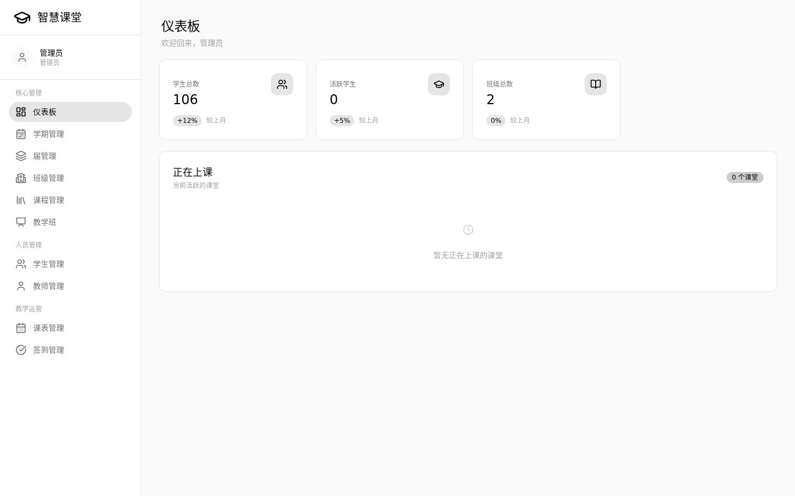

- **统计卡**：`学生总数`、`活跃学生`、`班级总数`
- **正在上课**区块：显示当前活跃课堂，格式 `【课程名】班级名` + 教师名 + `开始于 …`，每 30 秒自动刷新

---

### 3.2 学期管理

**入口**：核心管理 → 学期管理
**页面说明**：管理学期，切换当前学期并复制开学数据

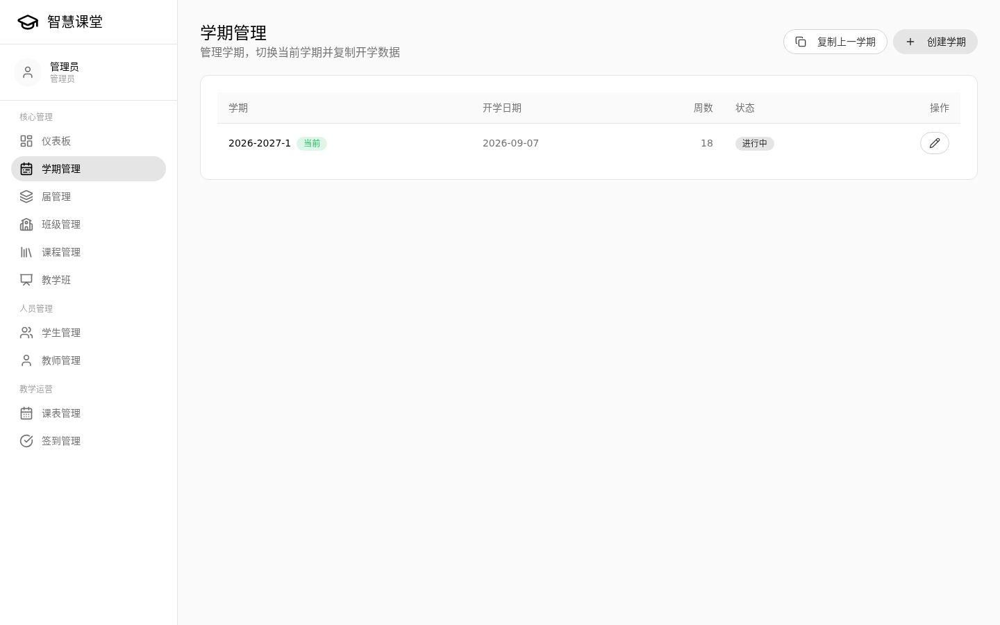

表格列：`学期`、`开学日期`、`周数`、`状态`、`操作`。当前学期在「学期」列带**当前**徽标；状态为 `进行中` / `已归档`。

| 我要做什么 | 怎么做 |
|---|---|
| 新建学期 | 点「创建学期」→ 填 **学期标识**（建议 `学年-学期` 格式，如 `2026-2027-1`）、**开学日期**、**总周数**（默认 20，允许 1–30）→ 创建 |
| 改开学日期 / 周数 | 点该行铅笔图标 → 修改 → 保存 |
| 切换当前学期 | 点该行「设为当前」→ 确认。弹窗原文：**确定切换到 '{学期标识}' 吗？签到、课表与成绩数据都将按该学期口径展示。** |
| 复制上一学期 | 点「复制上一学期」→ 开始复制。原文：**将上一学期的学生行政班归属、开课计划与选课名单复制到当前学期（教师默认留任）。请先创建并切换目标学期。** |

> ⚠️ 三个要点
> 1. **学期标识创建后不可修改**，只可改日期与周数。
> 2. 「设为当前」只对状态为 `进行中` 的学期显示；`已归档` 学期不能设为当前。
> 3. 全站同一时间只有一个当前学期。切换后，签到、课表、成绩与统计都按新学期的口径展示。

创建学期弹窗：

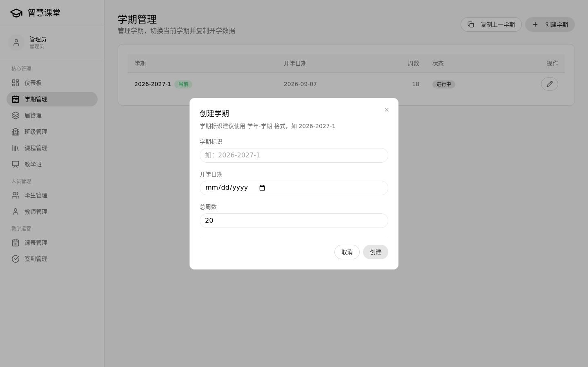

---

### 3.3 届管理

**入口**：核心管理 → 届管理
**页面说明**：按入学年份管理届，毕业时归档

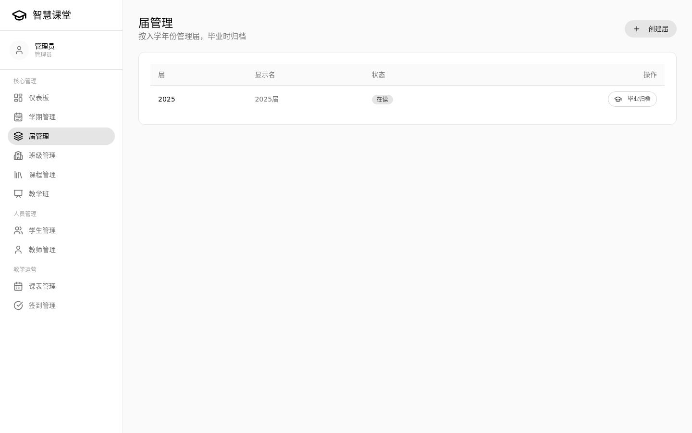

表格列：`届`、`显示名`、`状态`、`操作`；状态为 `在读` / `已毕业`。

| 我要做什么 | 怎么做 |
|---|---|
| 新建届 | 点「创建届」→ 填 **入学年份**（如 `2026`）、**显示名**（如 `2026届`，留空则默认「年份届」）→ 创建 |
| 毕业归档 | 点「毕业归档」→ 确认（原文：确定将 '{显示名}' 标记为已毕业吗？归档后可在列表恢复。） |
| 撤销归档 | 点「恢复」——**点击即生效，无二次确认** |

---

### 3.4 班级管理

**入口**：核心管理 → 班级管理
**页面说明**：按届管理班级，创建后可为学生分配

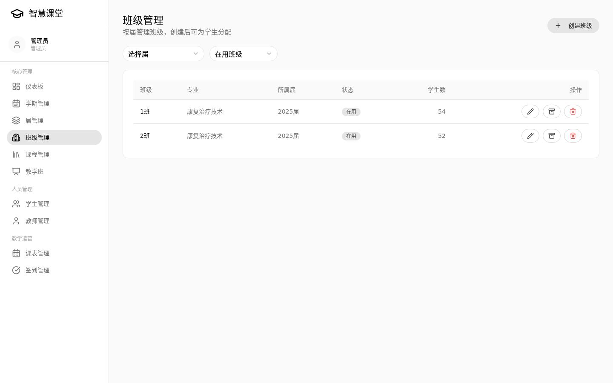

**表格上方筛选**：届（`全部届` / 具体届）、显示范围（`在用班级` 默认 / `含已归档`）
表格列：`班级`、`专业`、`所属届`、`状态`、`学生数`、`操作`；状态为 `在用` / `已归档`。

#### 创建班级（支持一次建多个）

点「创建班级」，填三项：

| 字段 | 说明 |
|---|---|
| 所属届 | 下拉选择，如 `2026届` |
| 专业 | 如 `计算机科学与技术` |
| 班级名 | 支持批量写法：`1-5`（范围）或 `1班,3班`（枚举），分隔符可用 `,` `，` `、` |

- 输入时下方实时预览：**将创建：1班、2班、3班…**（超过 5 个显示前 5 个 + 等 N 个）
- 创建结果提示：`已创建 3 个班级`；若有重名：`已创建 2 个班级，跳过 1 个已存在`

输入 `3-5` 时的弹窗效果（下方蓝字即为预览）：

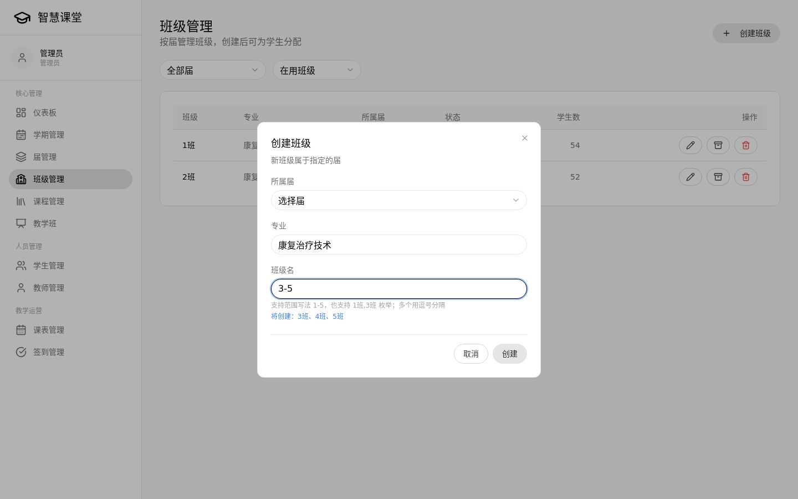

**班级显示名规则**：`{届}届{专业}{班级名}`，例如 `2026届计算机科学与技术1班`。系统内所有下拉框都显示这个完整名 —— 因为不同专业可能有同名班级。

#### 改名 / 归档 / 恢复 / 删除

| 操作 | 说明 |
|---|---|
| 编辑（铅笔图标） | 可改**班级名**与**专业**，所属届不可改 |
| 归档 | 原文：确定要归档 '{班级显示名}' 吗？归档后不再出现在班级列表与下拉中，历史课堂、签到与成绩完整保留，可随时恢复。 |
| 恢复 | 点击即恢复，无二次确认 |
| 删除（红色垃圾桶） | 原文：确定要删除 '{班级显示名}' 吗？班级仍被学生、课表、课堂等引用时将无法删除。 |

> 💡 **归档还是删除？**
> - 班级毕业、本学期不再开课 → 用**归档**（数据保留，可恢复）
> - 班级是建错的、且没有学生和课表 → 用**删除**
> - 删除失败通常说明该班仍被学生、课表或课堂引用，请改用归档

---

### 3.5 课程管理

**入口**：核心管理 → 课程管理
**页面说明**：维护课程目录，教学班开课时选用

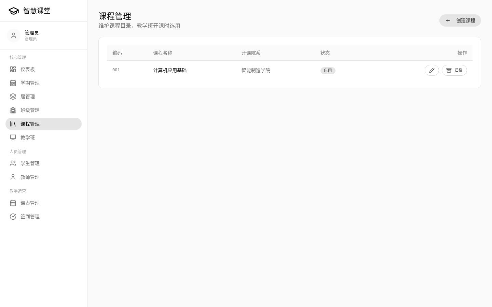

表格列：`编码`、`课程名称`、`开课院系`、`状态`、`操作`；状态为 `启用` / `已归档`。

| 我要做什么 | 怎么做 |
|---|---|
| 新建课程 | 点「创建课程」→ 填 **课程编码**（建议院系缩写+序号，如 `MATH1001`）、**课程名称**（如 `高等数学`）、**开课院系**（可留空）→ 创建 |
| 修改课程 | 点铅笔图标 → 可改**课程名称**与**开课院系**；**编码创建后不可改** |
| 归档 / 恢复 | 点该行的「归档」或「恢复」——**点击即生效，无二次确认** |

---

### 3.6 教学班管理（开课 + 选课名单）

**入口**：核心管理 → 教学班
**页面说明**：按学期开课、安排教师并管理选课名单

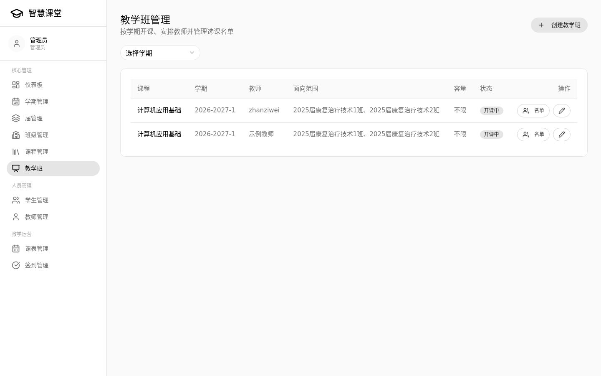

顶部按**学期**筛选（默认当前学期）。表格列：`课程`、`学期`、`教师`、`面向范围`、`容量`、`状态`、`操作`。
- 教师为空显示 `待安排`；容量为空显示 `不限`；状态为 `开课中` / `已结课`。

#### 创建一个教学班

点「创建教学班」，填：

| 字段 | 说明 |
|---|---|
| 课程 | 下拉，显示为 `课程名（编码）` |
| 学期 | 默认预填当前学期 |
| 教师 | 可先选 `待安排`，之后再指派 |
| 面向范围 | 勾选班级，决定**这位教师能管理哪些班的学生**（详见下方说明） |
| 容量 | 选课人数上限，可留空表示不限 |

**面向范围怎么用**（重要）：

- 提供「全选 / 清空」按钮，班级按 `{届}届 · {专业}` 分组
- **一个班都不选 = 面向全部班级（通配）** —— 教师可以看到全校学生
- 选了若干班 = 教师只能看到这些班的学生（这是教师权限的依据）
- 仅「在用」班级可选，已归档班级不出现

> 💡 只想给某个老师带一个班的课，就只勾选那个班；想让老师带全年级，勾选对应几个班；无特殊要求才留空（通配）。

创建教学班弹窗（面向范围按「届 · 专业」分组）：

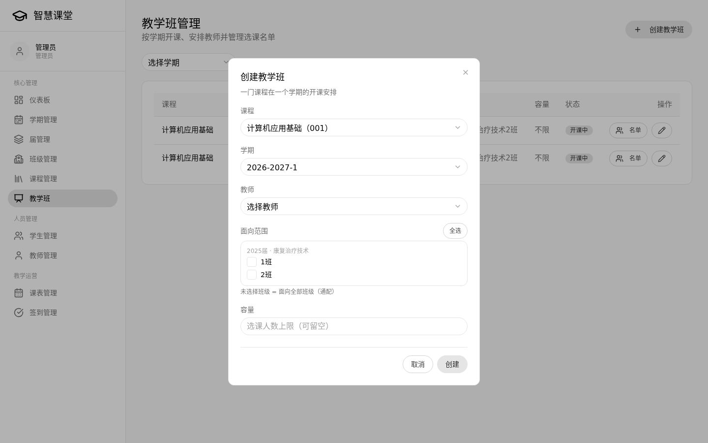

#### 编辑教学班

点铅笔图标 → 可改 **教师**、**面向范围**、**容量**。保存时面向范围是**整体替换**：清空所有勾选即改回「面向全部班级」。

#### 管理选课名单

在列表中点某教学班的「**名单**」按钮。弹窗标题为 `{课程名} · 选课名单`，说明：批量导入学号（每行一个），退课保留历史记录。

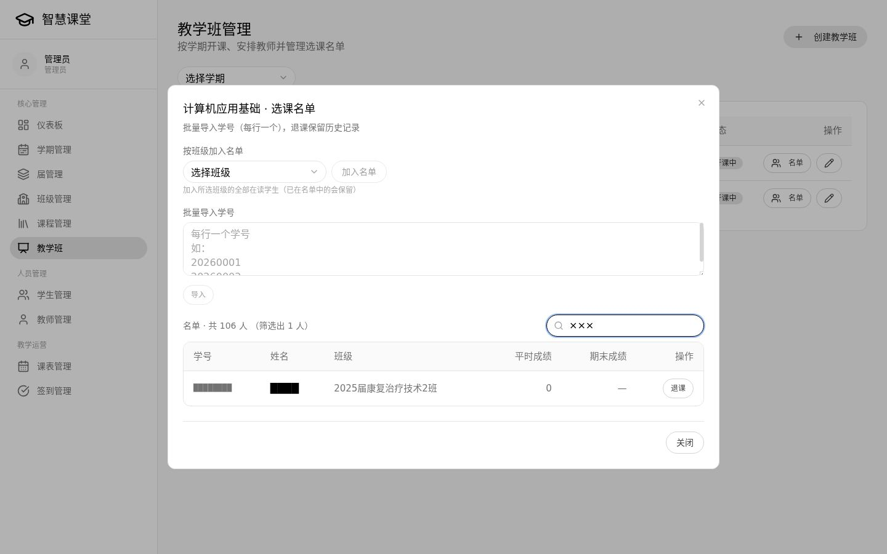

（上图是搜索 `2513010202` 后的效果：`名单 · 共 106 人（筛选出 1 人）`。）

两种加人方式：

| 方式 | 步骤 | 结果提示 |
|---|---|---|
| 按班级加入名单 | 选班级 → 点「加入名单」 | `按班级加入 106 人，跳过 0 人`。提示原文：**加入所选班级的全部在读学生（已在名单中的会保留）** |
| 批量导入学号 | 在文本框每行输入一个学号 → 点「导入」 | `导入 28 人，跳过 3 人`（跳过的是已在名单中的） |

名单区：

- 标题显示 **名单 · 共 106 人**；搜索后追加 **（筛选出 1 人）**
- 搜索框：**搜索学号或姓名...**，输入即过滤
- 表格列：`学号`、`姓名`、`班级`、`平时成绩`、`期末成绩`、`操作`（期末成绩未登记显示 `—`）
- 行内「退课」：**点击即退课，无二次确认**；退课保留历史记录（成绩与记录不丢）
- 搜索无结果时提示：`没有匹配的学生` / `换个学号或姓名试试`

> 💡 每打开一次弹窗，搜索框会自动清空，避免上次的搜索词挡住新数据。

---

---

### 3.7 学生管理

**入口**：人员管理 → 学生管理
**页面说明**：管理学生档案和分数

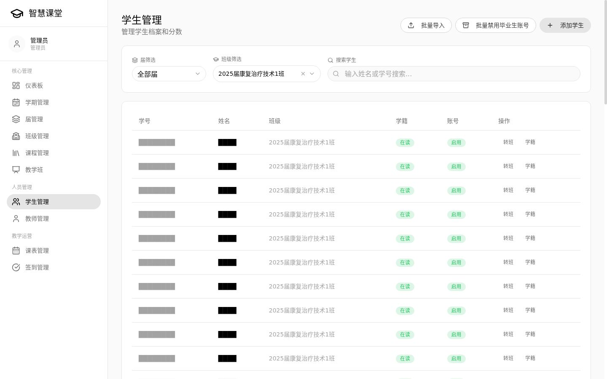

顶部三个按钮：`批量导入`、`批量禁用毕业生账号`、`添加学生`。筛选区：**届筛选**、**班级筛选**、**搜索学生**（占位 `输入姓名或学号搜索...`）。

表格列：`学号`、`姓名`、`班级`、`学籍`、`账号`、`操作`（每页 50 人，分页显示 `1 / 3（共 106 人）`；搜索时显示 `找到 N 名匹配的学生`）。

| 我要做什么 | 怎么做 |
|---|---|
| 加一个学生 | 点「添加学生」→ 填 `学号`、`姓名`、`所属届`、`班级` → 添加。提示：`学生 张三 添加成功` |
| 改学籍状态 | 点该生「学籍」→ 选 `在读` / `休学` / `退学` / `毕业` → 保存。原文：**休学/退学/毕业的学生将保留历史数据** |
| 转班 | 点该生「转班」→ 选 `目标届` 与 `目标班级` → 确认转班 |
| 批量加人 | 点「批量导入」（见下） |
| 毕业清账号 | 点「批量禁用毕业生账号」→ 勾选班级 → 确认禁用。原文：**禁用后学生无法登录（适用于毕业/离校学生）** |

#### 批量导入学生（Excel）

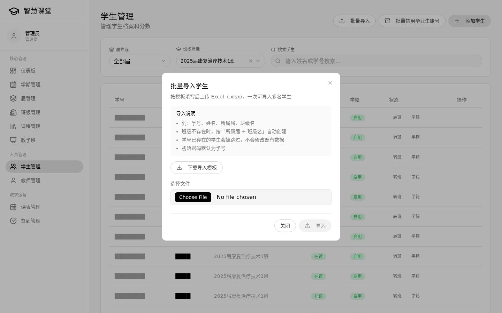

1. 点「下载导入模板」得到 `学生导入模板.xlsx`（含「学生名单」与「填写说明」两个工作表）。
2. 按模板填写 —— 列头为：`学号`、`姓名`、`所属届`、`专业`、`班级名`。

   | 列 | 说明（模板原文） |
   |---|---|
   | 学号 | 必填，唯一。已存在的学号会被跳过（不会修改既有学生） |
   | 姓名 | 必填 |
   | 所属届 | 如 `2025`；班级不存在时用于自动建班，班级已存在可留空 |
   | 专业 | 必填，如 `康复治疗技术`（与「所属届 + 班级名」一起定位班级） |
   | 班级名 | 必填，如 `1班`（**只写班名**，不要带届和专业；完整班级名由系统按「届+专业+班名」拼成） |

3. 点「选择文件」（仅 `.xlsx`）→ 点「导入」。
4. 结果：`成功 106 跳过 3`，逐行列出失败/跳过原因。

> ⚠️ 注意事项
> - **初始密码默认为学号**，请提醒学生首次登录后改密码。
> - **学号已存在会被跳过**，不会更新已有学生的信息；要改信息请在列表里编辑。
> - **班级不存在时会自动建班**（按届+专业+班名）；若班级不存在且**没填所属届**，该行会失败并提示 `班级「…」不存在且未填写所属届`。
> - 限制：单次最多 **2000 行**、文件最大 **10MB**、只接受 `.xlsx`；缺列会提示 `缺少必需列: …（请使用导入模板）`。
> - 班级名留空或写 `未分班` 的学生**不挂到任何班**。

> 💡 **为什么列表里只看到部分学生？**
> 页面默认会自动选中**第一个班级**，因此初次进入只显示该班学生。切换到「全部届」或用搜索框按姓名/学号搜索即可看到其他学生。

---

### 3.8 教师管理

**入口**：人员管理 → 教师管理
**页面说明**：管理教师账号

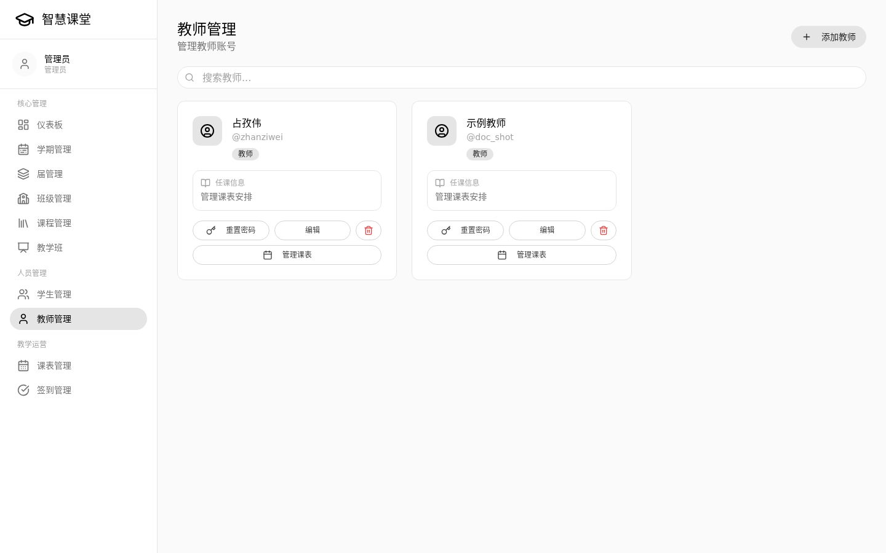

每张教师卡片显示姓名、`@用户名`、任课信息，以及按钮：`重置密码`、`编辑`、删除图标、`管理课表`。

| 我要做什么 | 怎么做 |
|---|---|
| 加教师 | 点「添加教师」→ 填 `用户名`（≥3 字符）、`姓名`、`密码`（≥6 位）、`确认密码` → 创建。用户名重复会提示 `用户名已存在` |
| 改姓名 | 点「编辑」→ 改 `姓名` → 保存（用户名不可改） |
| 重置密码 | 点「重置密码」→ 输入并确认新密码（≥6 位）→ 重置密码 |
| 删教师 | 点删除图标 → 确认（原文：**确定要删除教师 '{name}' 吗？此操作不可恢复。**） |
| 排课 | 点「管理课表」（见下） |

#### 管理教师课表

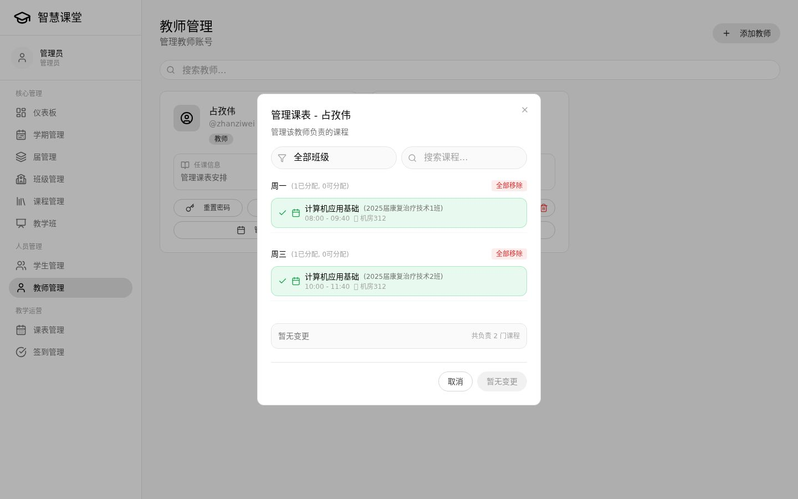

弹窗「管理课表 - {教师姓名}」，按周一~周日分区，每天显示 `（N已分配, M可分配）`。

1. 用「全部班级」下拉和「搜索课程...」缩小范围。
2. 在课程上点「全部添加」加入该教师，或点已加入课程上的「移除」（悬停出现）。
3. 底部会显示变更摘要：`+3 门新增`、`-1 门移除`、`共负责 5 门课程`，点「保存变更 (N)」提交。

> ⚠️ 已被其他教师占用的课程显示 `已由 … 授课` 且置灰，不能分配；如需换人，先在该教师处移除。

---

### 3.9 课表管理

**入口**：教学运营 → 课表管理
**页面说明**：管理课程安排，支持批量导入

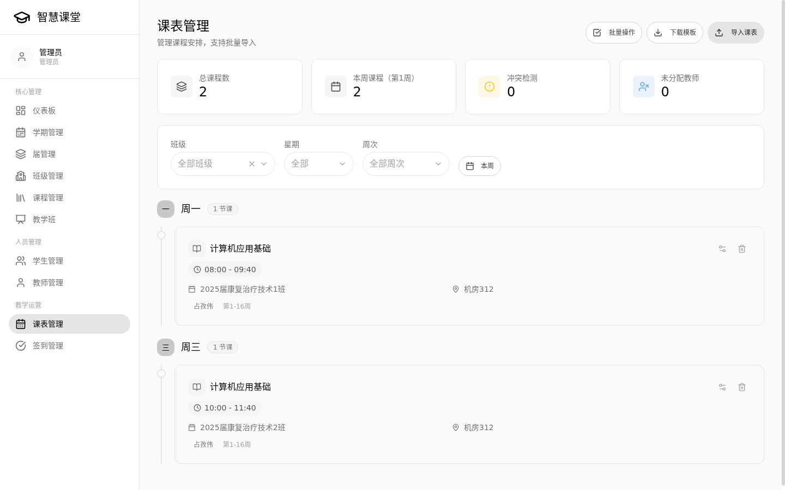

- **统计卡**：`总课程数`、`本周课程（第N周）`、`冲突检测`、`未分配教师`
- **筛选**：`班级`、`星期`、`周次`，以及「本周」快捷按钮
- **课程卡**：课程名、状态徽标（`已停课`/`已调课`/`补课`/`本周跳过`/`进行中`/`已结束`）、时间段、班级、教室、周次、教师徽标（未排课显示 `未分配教师`）
- **冲突提示**：卡片上出现红点与 `教师时间冲突：…` / `教室冲突：…`

| 我要做什么 | 怎么做 |
|---|---|
| 导入课表 | 点「下载模板」→ 按模板填写 → 点「导入课表」（支持 `.xlsx` / `.csv`） |
| 调课 / 停课 / 补课 | 点课程卡上的齿轮按钮 → 选 `停课` / `调课` / `补课` → 填 `调整原因`（调课/补课还需填新日期、新时间、新教室）→ 提交 |
| 删一门课 | 点卡片上的删除图标 → 浏览器确认框 → 确定 |
| 批量删课 | 点「批量操作」→ 勾选课程 → 底部「批量删除」→ 确认 |

**导入模板列**：`课程名称`、`所属届`、`专业`、`班级名`、`教师姓名`、`星期`、`开始时间`、`结束时间`（可选：`教室`、`开始周`、`结束周`、`周类型`）。**星期用数字：1=周一 … 7=周日。**

> ⚠️ 注意事项
> - 课表导入**不会自动建班**：班级必须先在「班级管理」里建好，否则该行报 `班级不存在或所有学生已禁用`。
> - 同一门课在**同一班级、同一天、同一时间**重复导入会报 `课程已存在（…）`。
> - 单次导入最多 **1000 行**；时间格式错误、星期不在 1-7、存在空值都会逐行报错。
> - 教师只能调整**自己的**课；删除、导入、批量操作只有管理员可见。

---

### 3.10 签到管理

**入口**：教学运营 → 签到管理
**页面说明**：查看当前活跃课堂的签到统计

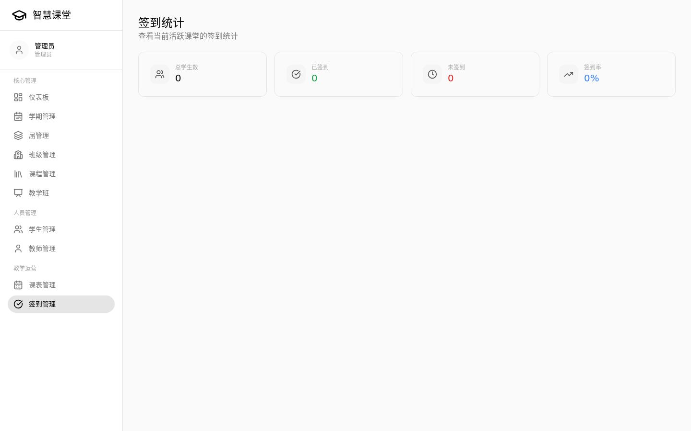

页面显示四张统计卡：`总学生数`、`已签到`、`未签到`、`签到率`，数据 10 秒自动刷新。

- **有多个课堂同时进行**时，右上角出现下拉，可切换要查看的课堂
- **当前没有课堂**时，页面显示 `当前没有进行中的课堂`，并提示教师开始课堂后这里会实时显示数据

> 💡 这里的数字只统计**所选课堂**对应班级的学生（总人数 = 该班学生数）。上图为某班 54 人、已签到 3 人、签到率 5.6% 的实际效果。

---

## 4. 教师操作

### 4.1 教师仪表板

**入口**：仪表板（教师登录后的首页）
**页面说明**：欢迎回来，教师

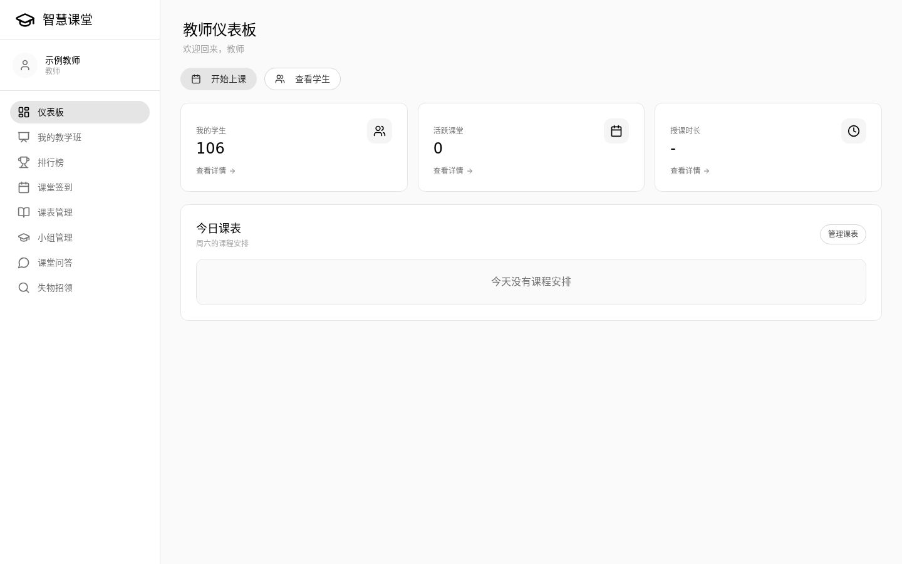

- **快捷操作**：`开始上课`、`查看学生`
- **统计卡**：`我的学生`、`活跃课堂`、`授课时长`（点击卡片可进入对应页面；授课时长目前固定显示 `-`）
- **今日课表**：显示 `{周X}的课程安排`，每节课带按钮 `进入课堂`（课堂进行中）/ `去上课` / 文本 `已结束` / 徽标 `已停课`，右上「管理课表」跳转课表页

> 💡 今天没课时会显示 `今天没有课程安排`。

---

### 4.2 我的教学班

**入口**：我的教学班
**页面说明**：本学期授课任务与成绩管理

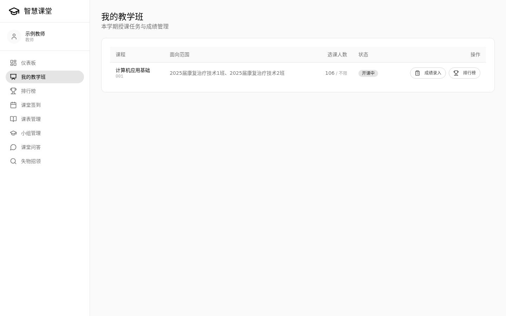

表格列：`课程`（课程名 + 课程代码）、`面向范围`、`选课人数`（显示 `{已选} / {容量或"不限"}`）、`状态`（`开课中` / `已结课`）、`操作`。

每行两个按钮：

- **成绩录入** → 进入该教学班的名单与成绩页（见 4.3）
- **排行榜** → 直接查看该课程的排行榜

> 💡 显示 `本学期暂无授课任务` 说明管理员还没给你安排教学班，请联系管理员。

---

### 4.3 成绩录入（加减分 / 期末成绩）

**入口**：我的教学班 → 成绩录入

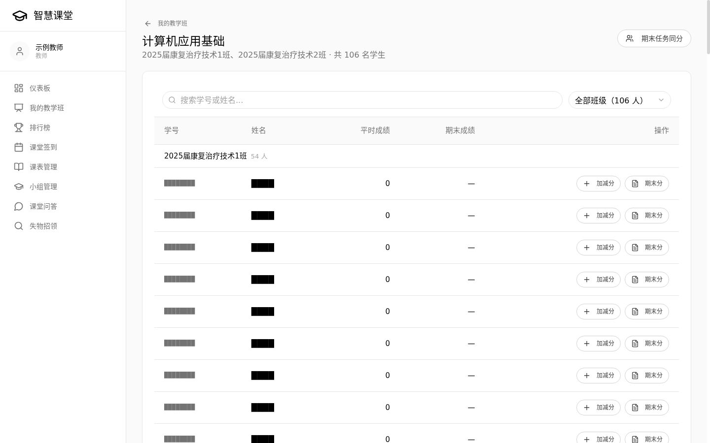

**页面结构**

- 顶部：课程名 + `{面向范围} · 共 106 名学生`，筛选后追加 `（筛选出 1 人）`
- 工具栏：**搜索学号或姓名...** + **班级下拉**（`全部班级（106 人）`、`2025届康复治疗技术1班（54 人）`…）
- 名单**按行政班分组**，组标题形如 `2025届康复治疗技术1班 54 人`
- 表格列：`学号`、`姓名`、`平时成绩`、`期末成绩`、`操作`（未登记期末分显示 `—`）

> 💡 106 人的名单不要靠翻找：直接搜学号或姓名，或把班级切到目标班。

#### 加减分（平时成绩）

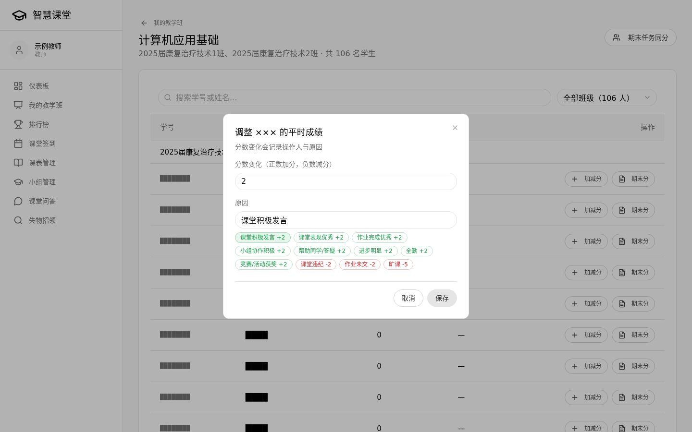

点某学生的「加减分」：

1. **分数变化（正数加分，负数减分）**：填 `5` 或 `-3`
2. **原因**：必填；可直接点下方**快捷标签**，标签会同时填入原因与分值
3. 点「保存」→ 提示 `分数已更新`

**快捷标签**（可直接点）：

| 加分（+2） | 减分 |
|---|---|
| 课堂积极发言、课堂表现优秀、作业完成优秀、小组协作积极、帮助同学/答疑、进步明显、全勤、竞赛/活动获奖 | 课堂违纪 `-2`、作业未交 `-2`、旷课 `-5` |

> ⚠️ 注意事项
> - **原因必填**（最多 200 字），不填会提示 `请输入分数变化原因`。
> - 分数是**累加**的：新分 = 当前分 + 变化值，然后**限制在 0–100 之间**。例如 0 分的旷课 `-5` 仍是 0 分。
> - 若同时在别处改过这个学生，保存时会提示 `分数已被其他用户修改，请刷新后重试`，刷新页面再操作。
> - 每次加减分都会记录**操作人与原因**，可在小组页的「分数日志」等处查到。

#### 期末成绩：两种方式

| 方式 | 适用 | 操作 |
|---|---|---|
| **期末分**（单人） | 试卷考试，每人分数不同 | 点学生「期末分」→ 填分数（如 88）→ 登记。原文提示：**试卷考试使用个人分数；任务考核请用「期末任务同分」** |
| **期末任务同分**（整组） | 小组任务考核，组内同分 | 点右上「期末任务同分」→ 选 `班级` + `小组` + `期末成绩` → 登记，提示 `期末成绩已登记（6 人）` |

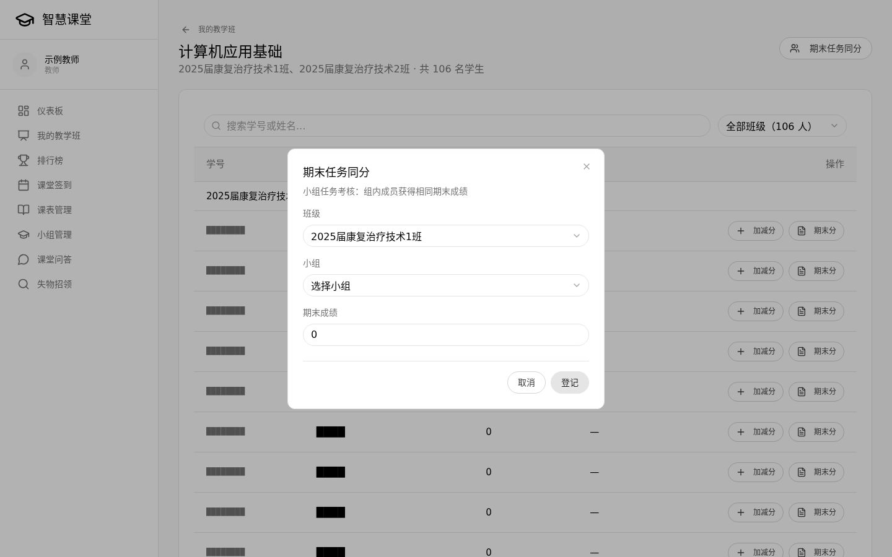

> ⚠️ 「期末任务同分」只影响**该小组成员中、选了这门课**的学生；小组在「小组管理」里创建。
> ⚠️ 期末分是**直接赋值**（不是累加），输入框不限制 0–100，请自行填合理分数。

---

### 4.4 排行榜

**入口**：排行榜
**页面说明**：按所授科目查看个人与小组成绩排名

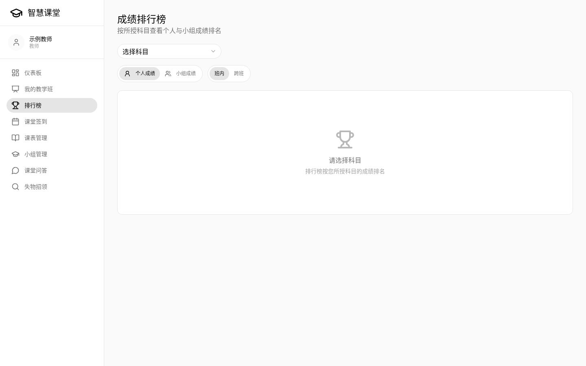

1. 选**科目**（下拉来自你本人授课的课程）
2. 切**类型**：`个人成绩` / `小组成绩`
3. 切**范围**：`班内` / `跨班`；班内时再选班级（默认第一个班）

表格列：`排名`、`学生`（小组模式为 `小组`）、`班级`（跨班时显示）、`成绩`。小组行下方以 `、` 连接显示成员。

> 💡 没有数据时提示 `暂无成绩数据` / `成绩录入后自动生成排名` —— 先去成绩录入里加分或登记期末分。

---

### 4.5 课堂签到

**入口**：课堂签到
**页面说明**：管理您的活跃课堂

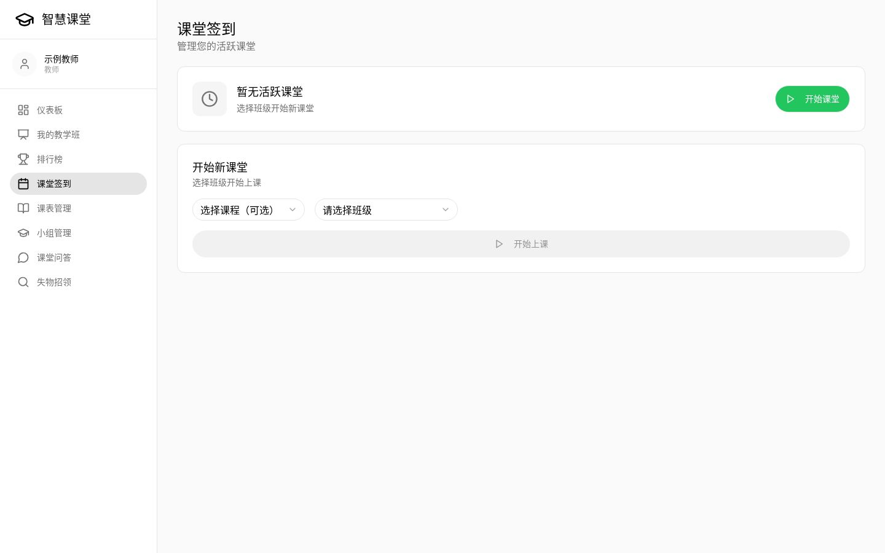

**开始课堂**

1. 点「开始课堂」（或「今日课表」里某节课的「开始」按钮）
2. 在表单里选 `课程（可选）` 与 `班级` → 「开始上课」

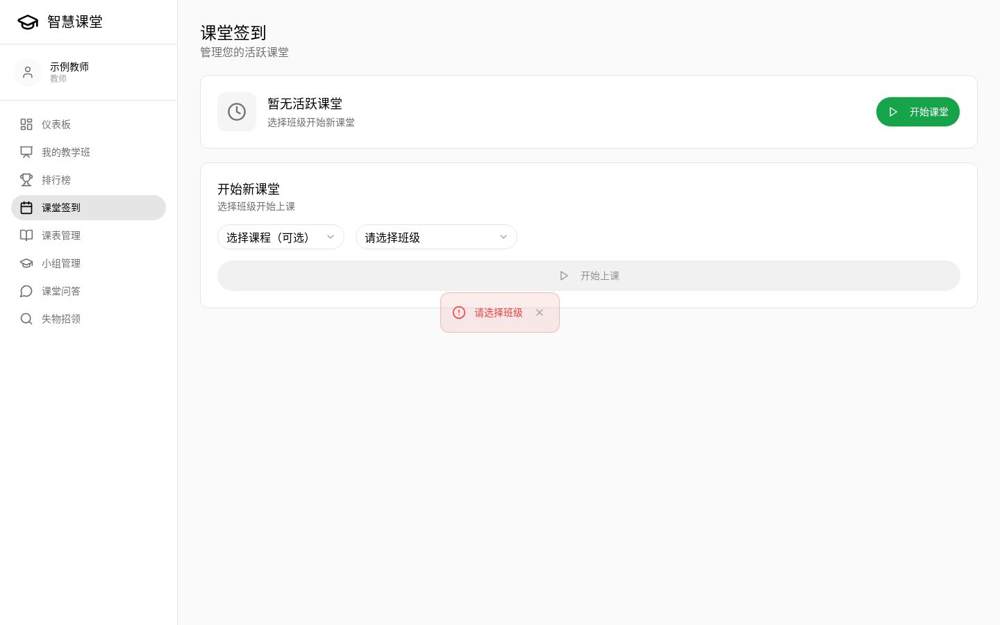

**学生签到（两种方式）**

| 方式 | 说明 |
|---|---|
| 验证码签到 | 学生在大屏/投影上看到**验证码**，输入验证码完成签到；验证码会**自动刷新**（页面显示 `自动刷新 Ns` 倒计时） |
| 按学号签到 | 在「学生签到」输入框输入学号回车（或点「签到」），提示 `学生签到成功！` |

- **签到进度**：显示 `已签到/总人数（N%）`，颜色随进度变化
- **班级学生列表**：分 `未签到 (N人)` 与 `已签到 (N人)` 两区，可点未签到学生卡片直接签到，也可用 `搜索学生姓名或学号...` 快速定位

**结束课堂**：点「结束课堂」→ 确认框显示 `已签到 N` / `未签到 N` → 确认结束。

> ⚠️ 注意事项
> - 一个班级**同时只能有一个课堂**：若某班被其他老师占用，班级选项会显示 `{班级} (已被 XX 老师占用)` 且不可选。
> - 可同时开多个课堂（给多个班上课），桌面端用标签页切换，移动端用下拉切换。
> - 开到第 3 个课堂会提示接近上限；**达到 5 个课堂**会提示软限制，继续需点「仍要继续」。
> - 下课后请**及时结束课堂**，否则学生仍可继续签到。

---

### 4.6 课表管理（教师）

**入口**：课表管理
**页面说明**：查看本人课表；教师可调整自己的课

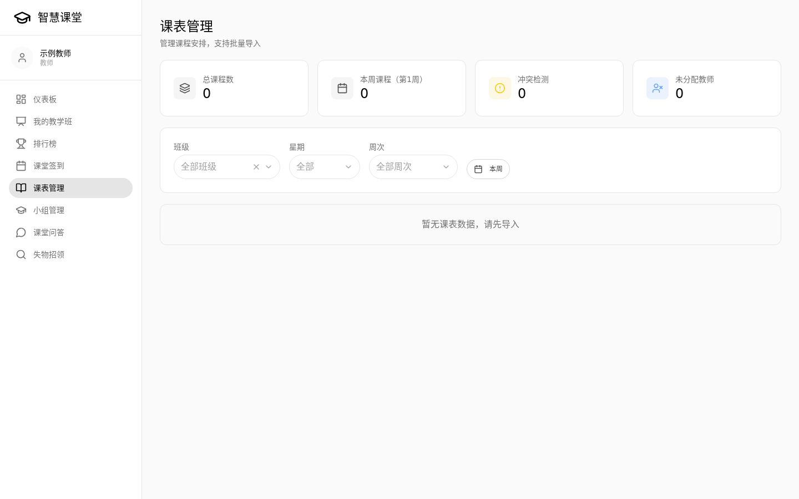

- 统计卡与筛选（班级 / 星期 / 周次 / 本周）与管理员端一致，但**教师看不到**「批量操作 / 下载模板 / 导入课表 / 删除」
- 点课程卡上的齿轮按钮发起 `停课` / `调课` / `补课`，提交后提示 `课程调整已提交`

> ⚠️ 教师只能调整**自己的课**；若时间冲突，提交时会提示 `{错误信息}（已有停课/调课/补课记录：原因）`。

---

### 4.7 小组管理

**入口**：小组管理
**页面说明**：查看班级小组并处理解散申请

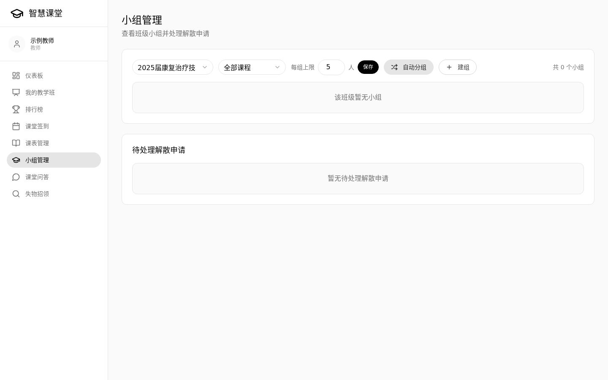

**工具栏**：班级下拉、课程下拉（`全部课程`）、`每组上限`（2–10 人）+「保存」、`自动分组`、`建组`，右侧显示 `共 N 个小组`。

| 我要做什么 | 怎么做 |
|---|---|
| 自动分组 | 选好班级与课程 → 点「自动分组」（未选会提示 `请先选择班级和课程`） |
| 建一个组 | 点「建组」→ 选 `课程`、填 `小组名称`（如 `数学A组`）→ 创建 |
| 改人数上限 | 改 `每组上限`（2–10）→ 保存，提示 `小组人数上限已更新` |
| 给小组加减分 | 点小组卡「加减分」→ 填 `分数变化` + `原因`（必填，也可点快捷标签）→ 确认加减分 |
| 换组长 | 点「转让组长」→ 输入**新组长学号** → 确认转让 |
| 踢人 | 展开小组成员 → 点成员后的「踢出」（踢出最后一人时小组自动解散） |
| 解散小组 | 点「解散小组」→ 确认（原文：**确定要解散小组「{名称}」吗？此操作不可撤销。**） |
| 处理解散申请 | 在「待处理解散申请」里点 `拒绝` 或 `批准解散` |

> ⚠️ 小组加减分要求**分值不为 0 且原因非空**，两项缺一都会拦下；分值同样限制在 0–100。
> 💡 加减分弹窗内的「分数日志」会列出历史记录：`{原因} +N（旧分 → 新分）`。

---

### 4.8 课堂问答

**入口**：课堂问答

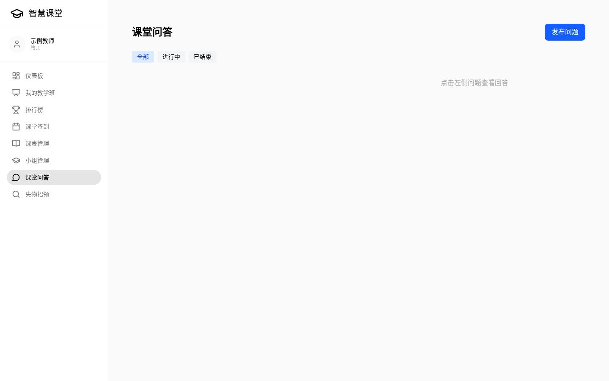

**发布问题**：点右上「发布问题」→ 输入问题内容 → 选 `目标班级`（默认 `所有班级`）→ 可勾选 `实时提问` → 发布。

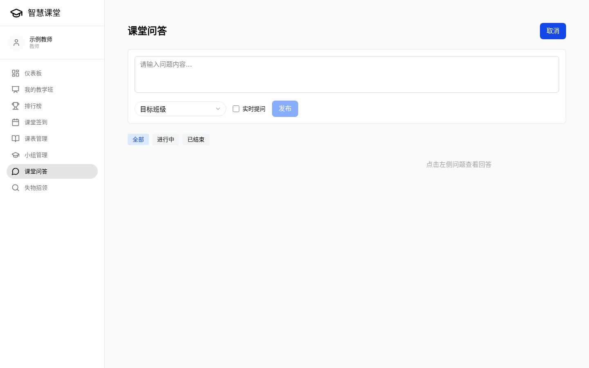

**管理问题**：用 `全部` / `进行中` / `已结束` 切换筛选；问题卡上显示 `进行中`/`已结束`、`实时` 徽标、班级、`N 条回答`，可点「查看回答」或「结束」（仅进行中的问题有）。

**回答区**：可对单条回答点「追问」（输入追问内容 → 发送追问）、点「标记优秀」/「取消优秀」；学生可匿名回答，列表里会标 `匿名`。

> 💡 点「结束」后学生不能再提交回答，但历史回答仍可查看。

---

### 4.9 失物招领

**入口**：失物招领
**页面说明**：管理和发布失物招领信息

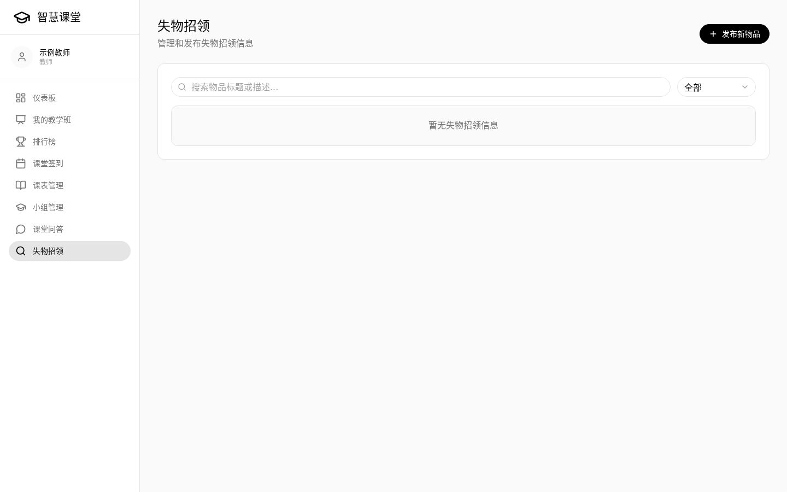

- 搜索框 `搜索物品标题或描述...`；状态筛选 `全部` / `发布中` / `认领中` / `已关闭`
- 卡片显示标题、状态、描述摘要、地点、发布日期、`认领 N 条`、`待处理 N`；每页 12 条

**发布物品**：点「发布新物品」→ 填 `标题 *`、`描述 *`、`地点`（选填）、可上传 `图片`（JPG/PNG，最大 10MB，自动压缩）→ 发布物品。

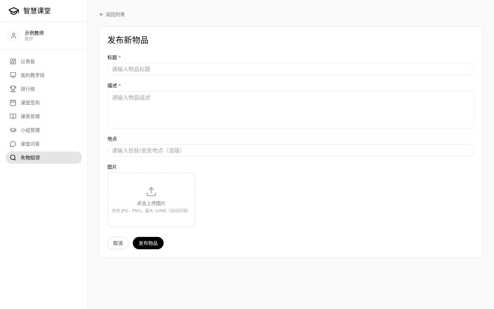

**详情页**：可 `编辑` / `删除`（删除需确认，原文：**删除后不可恢复，确定要删除此物品吗？**）；下方有 `评论 (N)` 与 `认领申请 (N)`，对认领申请可点 `确认` 或 `拒绝`。

> ⚠️ 标题与描述为必填；图片上传失败会提示 `图片大小不能超过 10MB` 或 `请选择图片文件`。

---

---

## 5. 开学准备清单

按下面的顺序做，一次跑通整条链路（前 7 步是**一次性基础数据**，第 8 步起**每学期重复**）。

### 5.1 基础数据（管理员，通常只做一次）

| # | 做什么 | 去哪做 |
|---|---|---|
| 1 | 建**届**（如 `2026届`） | 核心管理 → 届管理 → 创建届 |
| 2 | 建**班级**（所属届 + 专业 + 班级名，支持 `1-5` 一次建多个） | 核心管理 → 班级管理 → 创建班级 |
| 3 | 建**课程**（如 `MATH1001 高等数学`） | 核心管理 → 课程管理 → 创建课程 |
| 4 | 建**学期**并「设为当前」 | 核心管理 → 学期管理 |
| 5 | 建**教师账号**，把用户名与初始密码交给老师 | 人员管理 → 教师管理 → 添加教师 |
| 6 | **导入学生**（Excel 模板，初始密码=学号） | 人员管理 → 学生管理 → 批量导入 |
| 7 | （可选）**导入课表**，教师端「今日课表」才有内容 | 教学运营 → 课表管理 → 导入课表 |

### 5.2 每学期开课（管理员）

| # | 做什么 | 去哪做 |
|---|---|---|
| 8 | **开教学班**：选课程 + 学期 + 教师 + **面向范围** + 容量 | 核心管理 → 教学班 → 创建教学班 |
| 9 | **导入选课名单**：推荐「按班级加入名单」一键收全班 | 教学班 → 该行的「名单」 |

### 5.3 学期结束 / 新学期开始（管理员）

| # | 做什么 | 去哪做 |
|---|---|---|
| 10 | 建新学期 →「设为当前」→ 点「复制上一学期」（带过开班计划、选课名单与学生班级归属，教师默认留任） | 核心管理 → 学期管理 |
| 11 | 毕业处理：班级**归档** → 届**毕业归档** → 学生**批量禁用毕业生账号** | 班级管理 / 届管理 / 学生管理 |

### 5.4 教师每个班的日常

| 场景 | 操作 |
|---|---|
| 上课前 | 课堂签到 → 开始课堂（学生用验证码或学号签到） |
| 课堂表现 | 我的教学班 → 成绩录入 → 加减分（个人），或小组管理 → 加减分（小组） |
| 期末 | 试卷 → 逐个「期末分」；小组任务 → 「期末任务同分」 |
| 看排名 | 排行榜（按科目切换个人/小组、班内/跨班） |

---

## 6. 常见问题

### 6.1 登录与账号

| 问题 | 原因与处理 |
|---|---|
| 提示「用户名或密码错误」 | 三点都要对：**用户名、密码、所选角色**。同一个用户名只在它所属角色的入口能登录（教师账号选「教师」） |
| 教师忘了密码 | 管理员在 **教师管理 → 重置密码** 里设新密码 |
| 学生忘了密码 | 管理员在 **学生管理** 里改；批量导入的学生**初始密码就是学号** |
| 提示「账号已被禁用」 | 联系管理员启用账号（毕业生账号可能被批量禁用） |
| 提示登录过于频繁 | 触发了登录限流，等约 1 分钟再试 |

### 6.2 数据与权限

| 问题 | 原因与处理 |
|---|---|
| 学生管理里只有一部分学生 | 页面**默认选中第一个班级**。切换班级/届，或用搜索框按姓名、学号搜索 |
| 教师看不到某个班的学生 | 该教师的教学班「**面向范围**」里没有勾这个班；到 教学班 → 编辑 里补勾（不勾任何班＝面向全部班级） |
| 教学班名单是空的 | 名单要单独导入：教学班 →「名单」→「按班级加入名单」或批量导入学号 |
| 班级删不掉 | 该班仍被学生、课表或课堂引用。改用「**归档**」：数据保留、列表中隐藏、可恢复 |
| 分数加了没变化 | 分数被限制在 **0–100**：0 分学生的减分不会变成负数，100 分学生的加分不会超过 100 |
| 保存分数时提示「分数已被其他用户修改」 | 同一学生被别处改过，刷新页面再操作 |
| 期末成绩用哪种方式 | 试卷考试用「**期末分**」（每人不同）；小组任务用「**期末任务同分**」（组内同分） |
| 课表导入报「班级不存在或所有学生已禁用」 | 课表导入**不自动建班**，先在班级管理里建好班级 |
| 导入课表报「课程已存在（…）」 | 同一班级、同一天、同一时间已有同一门课，避免重复导入 |
| 教师账号能登录但没有教学班 | 管理员还没给他开教学班，或教学班不在**当前学期** |

### 6.3 已知问题

| 位置 | 现象 | 临时办法 |
|---|---|---|
| 登录失败提示 | 角色选错时也提示「用户名或密码错误」，不够明确 | 记住：用户名、密码、角色三者必须匹配 |

> 已于 2026-09-12 修复并回归：学生列表表头错位、管理员签到统计恒为 0、仪表板写死的趋势百分比、批量导入说明漏「专业」列。

---

**文档维护**：页面改动后请同步更新本文与对应截图。截图位于 `docs/images/operations/`，取自实际系统（含真实学生姓名），对外分享前请先替换为演示数据。

